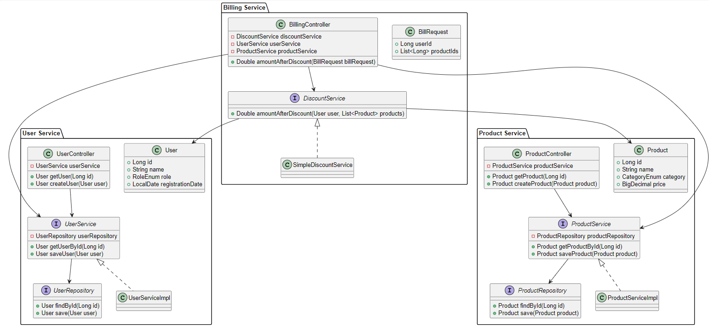

# Retail Site

Is an application to Calculate discount depending on Discount types.

### Prerequisites

- Java 17 and above
- Maven 3.3.2 and above
- Spring Boot 3 and above

### Installing

######Checkout the project from git

```
git clone https://github.com/dikshith-shetty/retail-site.git
```

######To run the application
```
mvn spring-boot:run
```

######To run tests

```
mvn clean install
```

## API documentation
http://localhost:8080/swagger-ui.html


## Sonar results
https://sonarcloud.io/summary/overall?id=dikshith-shetty_retail-site

## Class Diagram


## Built With

* [Java](https://docs.oracle.com/en/java/) - The language Java
* [Spring Framework](https://spring.io/) - Spring framework

## Authors

* **Dikshith Shetty**


